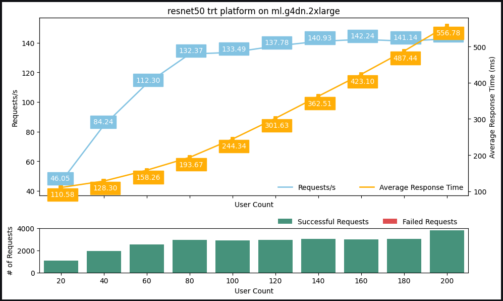
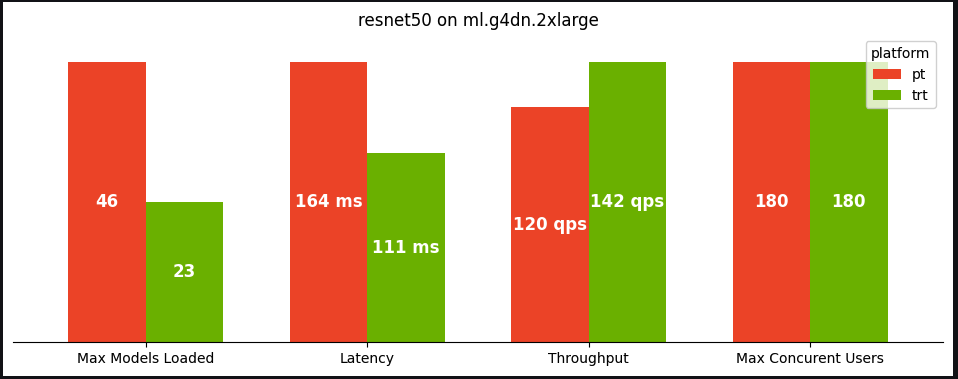

## SageMaker MME Benchmarking

This repo provides a sample implementation for benchmarking Real Time Inference workloads on GPU based SageMaker Multi-Model Endpoint (MME).SageMaker [multi-model endpoints](https://docs.aws.amazon.com/sagemaker/latest/dg/multi-model-endpoints.html) (MME) provide a scalable and cost-effective way to deploy  large numbers of ML models. It gives you the ability to deploy multiple ML models in a single serving container behind a single endpoint. From there, SageMaker will manage loading/unloading models and scaling resources on your behalf base on your traffic patterns. You will benefit from *sharing and re-using hosting resources* and a reduced *operational burden* from managing large quantity of models. 

## Usage
Make sure that your AWS identity has the requisite permissions which includes ability to create SageMaker Resources (Model, EndpointConfigs, Endpoints, and Training Jobs) in addition to S3 access to upload model artifacts. Alternatively, you can attach the [AmazonSageMakerFullAccess](https://docs.aws.amazon.com/sagemaker/latest/dg/security-iam-awsmanpol.html#security-iam-awsmanpol-AmazonSageMakerFullAccess) managed policy to your IAM User or Role.

Clone this repo into a Jupyter environment and run the provided notebooks

- [cv-benchmark.ipynb](cv-benchmark.ipynb) - Benchmark pretrained computer vision model either from torchvision or [timm](https://github.com/rwightman/pytorch-image-models) repos
- [nlp_benchmark.ipynb](nlp_benchmark.ipynb) - Benchmark pretrained NLP models from 🤗 [Hugging Face Hub](https://huggingface.co/docs/hub/index)

These notebook were tested in [SageMaker Studio](https://aws.amazon.com/sagemaker/studio/) on an **ml.c5.2xlarge** instance. An instance with 8 vCPU cores or greater is recommended for the load test.

## Additional Utilities
Additional utilities are provided within subdirectories. These may be helpful for other projects.
```
├── locust                      Contains the load testing python script
│   └── locust_benchmark_sm.py
├── model_config_templates      Contains Triton configuration templates for the various model types
│   ├── pt_cv_config.pbtxt
│   ├── pt_nlp_config.pbtxt
│   ├── trt_cv_config.pbtxt
│   └── trt_nlp_config.pbtxt
├── server_metrics              A Triton Python backend model that can be used to query endpoint metrics in real-time
│   ├── 1
│   │   └── model.py
│   └── config.pbtxt
└── utils                       A set of utility functions 
    ├── __init__.py
    ├── endpoint_utils.py       Endpoint configuration and deployment utils
    ├── model_utils.py          Utils for exporting models to various formats (torchscript, ONNX, TensorRT)
    └── viz_utils.py            Utils for analyzing and visualizing results
```

## Benchmark Outputs
When running the notebooks, results of the benchmark will be automatically written into a new `results` directory. The directory has the following structure where the top level folder is the name of the model benchmarked (e.g. bert-base-uncased) with several csv files that represent the raw [Locust output](https://docs.locust.io/en/stable/retrieving-stats.html) with the following naming convention **<instance_type>*<platform>*<model_loaded>_<locust_output_type>.csv**. The `summary_results.csv` file provides the overall summary of the benchmark.
```
├── results
│   ├── bert-base-uncased
│   │   ├── ml.g4dn.2xlarge*pt*26_exceptions.csv
│   │   ├── ml.g4dn.2xlarge*pt*26_failures.csv
│   │   ├── ml.g4dn.2xlarge*pt*26_stats.csv
│   │   ├── ml.g4dn.2xlarge*pt*26_stats_history.csv
│   │   ├── ml.g4dn.2xlarge*trt*42_exceptions.csv
│   │   ├── ml.g4dn.2xlarge*trt*42_failures.csv
│   │   ├── ml.g4dn.2xlarge*trt*42_stats.csv
│   │   ├── ml.g4dn.2xlarge*trt*42_stats_history.csv
│   │   └── summary_results.csv
```
In addition to the raw outputs, the notebook generates a pair of charts to provide a visual summary of the results.
The first chart provides a line graph that plots latency and throughput metrics (y-axis) for increasing number of concurrent users (x-axis) and a bar graph that shows the count of successful and failed inference requests.



The second chart shows a comparison of metrics between the PyTorch (libtorch) and TensorRT backends including the number of models loaded, the lowest latency, highest throughput, and the max number of concurrent users without any failed requests.



## Security

See [CONTRIBUTING](CONTRIBUTING.md#security-issue-notifications) for more information.

## License

This library is licensed under the MIT-0 License. See the LICENSE file.

